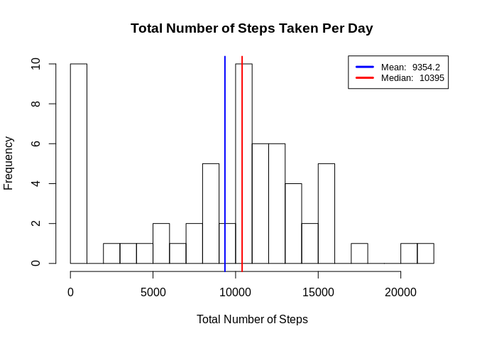
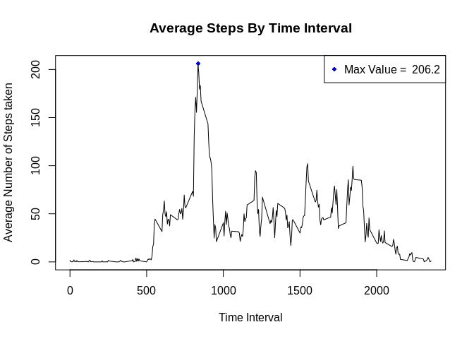
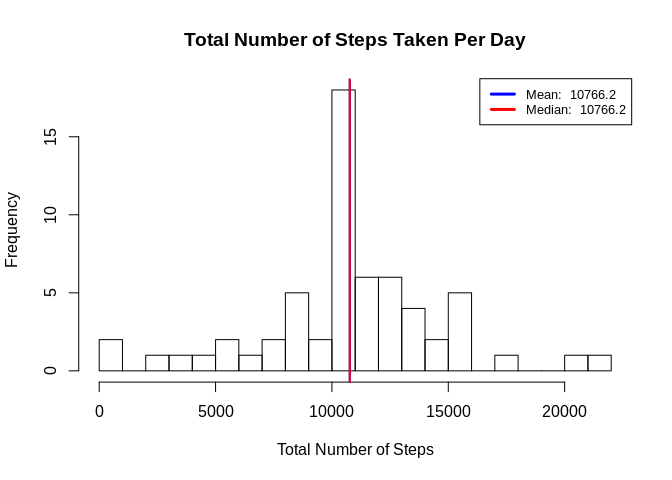
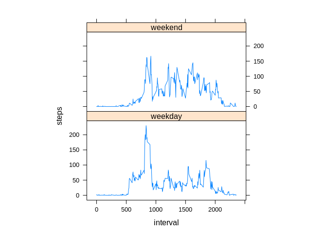

### Loading and preprocessing the data  

Description of this data from course is as following :  
  
*This assignment makes use of data from a personal activity monitoring device. This device collects data at 5 minute intervals through out the day. The data consists of two months of data from an anonymous individual collected during the months of October and November, 2012 and include the number of steps taken in 5 minute intervals each day.*  
  
There are three variables in the dataset:
  
1. **steps** : Number of steps taking in a 5-minute interval (missing values are coded as NA )
2. **date** : The date on which the measurement was taken in YYYY-MM-DD format
3. **interval** : Identifier for the 5-minute interval in which measurement was taken
  
Unzip and load the data into environment  
  

```r
unzip("activity.zip")
data <- read.csv("activity.csv")
```
  
---  
### What is mean total number of steps taken per day?  
  
- Calculate the total number of steps
- Create a histogram for the frequency of number of steps taken per day  
- Calculate the mean and median and show them in the graph  
  

```r
totalSteps <- aggregate(data$steps,by=list(data$date),na.rm=T,FUN=sum)

mean_value <- round(mean(totalSteps$x),1)
median_value <- round(median(totalSteps$x),1)

hist(totalSteps$x,
     main = "Total Number of Steps Taken Per Day",
     breaks = 20,
     xlab = "Total Number of Steps")

abline(v=mean_value,lwd=2,col="blue")
abline(v=median_value,lwd=2,col="red")

legend('topright', lty = 1, lwd = 3, col = c("blue", "red"),
               cex = .8, 
               legend = c(paste('Mean: ', mean_value),
               paste('Median: ', median_value))
               )
```

<!-- -->
  

### What is the average daily activity pattern?  
  
- Calculate the average number of steps taken across all day
- Plot a graph between time interval and average number of steps taken 
- Mention the maxima


```r
avgSteps <- aggregate(data$steps,by=list(data$interval),FUN=mean,na.rm=T)
maxSteps <- avgSteps[which.max(avgSteps$x),]

plot(avgSteps$Group.1,
     xlab = "Time Interval",
     ylab = "Average Number of Steps taken",
     main = "Average Steps By Time Interval",
     avgSteps$x,type = "l")
points(maxSteps,col="blue",lwd=2,pch=18)

legend("topright",pch = 18,lty=0, col = "blue",
       legend = paste("Max Value = ",round(maxSteps$x,1)))
```

<!-- -->

Maximum value of 206.2 at time interval 835  
  
### Imputing missing values
  
Find the total mising values


```r
sum(is.na(data$steps))
```

```
## [1] 2304
```

To fill the missing values:
- FInd the average number of steps taken on each day
- Merge that column to the data
- Create a function which would replace the NA values with mean value of that time interval


```r
names(avgSteps) <- c("interval", "meanSteps")
data <- merge(data,avgSteps,by="interval")

fill_na <- function(a,b){
  if(is.na(a))
     return(b)
  else
     return(a)
}
for (i in 1:nrow(data)) {
  data$steps[i] <- fill_na(data$steps[i],data$meanSteps[i])
}
```

Create histogram of the number of steps per day from the new data set


```r
totalSteps <- aggregate(data$steps,by=list(data$date),FUN=sum)

new_mean_value <- round(mean(totalSteps$x),1)
new_median_value <- round(median(totalSteps$x),1)

hist(totalSteps$x,
     main = "Total Number of Steps Taken Per Day",
     breaks = 20,
     xlab = "Total Number of Steps")

abline(v=new_mean_value,lwd=2,col="blue")
abline(v=new_median_value,lwd=2,col="red")

legend('topright', lty = 1, lwd = 3, col = c("blue", "red"),
               cex = .8, 
               legend = c(paste('Mean: ', new_mean_value),
               paste('Median: ', new_median_value))
               )
```

<!-- -->

Both the mean and median have increased  
Mean value has changed from 9354.2 steps per day to 1.07662\times 10^{4} steps per day  
Median value has changed from 1.0395\times 10^{4} steps per day to 1.07662\times 10^{4} steps per day  


### Are there differences in activity patterns between weekdays and weekends?

- Add a factor variable day which indicates weekend or weekday
- Compare the weekend and weekday activity

```r
data$day = ifelse(as.POSIXlt(as.Date(data$date))$wday%%6 == 
    0, "weekend", "weekday")
comparisonData = aggregate(steps ~ interval + day, data, mean)
library(lattice)
xyplot(steps ~ interval | factor(day), data = comparisonData, aspect = 1/2, 
    type = "l")
```

<!-- -->
